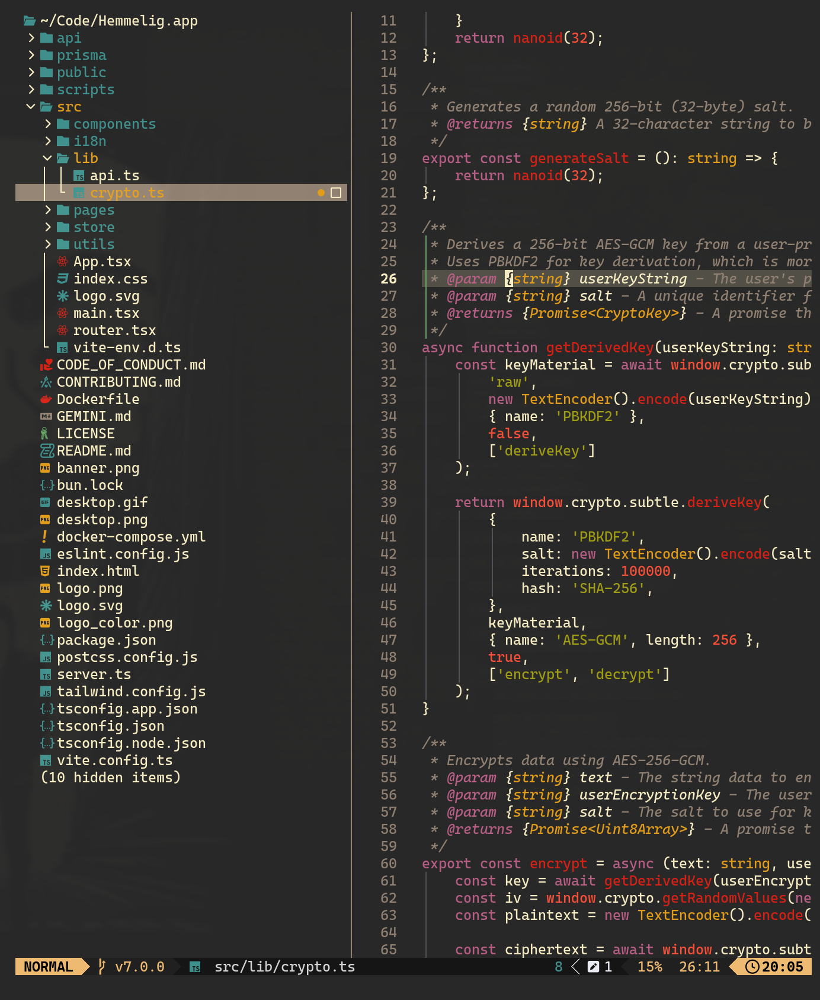

# Aether.nvim

A modern Neovim colorscheme with base16 color customization and extensive plugin support.



## Features

- Base16 color injection for easy customization
- Support for 25+ popular Neovim plugins
- Transparent background support
- Hot reload for development
- Lualine theme included

## Requirements

- Neovim 0.8+
- Terminal with true color support

## Installation

### Basic Setup (lazy.nvim)

```lua
{
    "bjarneo/aether.nvim",
    priority = 1000,
    config = function()
        require("aether").setup()
        vim.cmd.colorscheme("aether")
    end,
}
```

### With Custom Colors

```lua
{
    "bjarneo/aether.nvim",
    name = "aether",
    priority = 1000,
    opts = {
        transparent = false,
        colors = {
            -- Monotone shades (base00-base07)
            base00 = "#0c0c0c", -- Default background
            base01 = "#bfac89", -- Lighter background (status bars)
            base02 = "#0c0c0c", -- Selection background
            base03 = "#bfac89", -- Comments, invisibles
            base04 = "#e4bf7c", -- Dark foreground
            base05 = "#f5e8d1", -- Default foreground
            base06 = "#f5e8d1", -- Light foreground
            base07 = "#e4bf7c", -- Light background

            -- Accent colors (base08-base0F)
            base08 = "#d40d09", -- Variables, errors, red
            base09 = "#f6312d", -- Integers, constants, orange
            base0A = "#dd920a", -- Classes, types, yellow
            base0B = "#969408", -- Strings, green
            base0C = "#4a8699", -- Support, regex, cyan
            base0D = "#275d7c", -- Functions, keywords, blue
            base0E = "#bb3b74", -- Keywords, storage, magenta
            base0F = "#f6af2e", -- Deprecated, brown/yellow
        },
    },
    config = function(_, opts)
        require("aether").setup(opts)
        vim.cmd.colorscheme("aether")
    end,
}
```

### With Hot Reload (for development)

```lua
{
    "bjarneo/aether.nvim",
    name = "aether",
    priority = 1000,
    opts = {
        colors = {
            base00 = "#0c0c0c",
            base08 = "#d40d09",
            -- ... your colors
        },
    },
    config = function(_, opts)
        require("aether").setup(opts)
        vim.cmd.colorscheme("aether")

        -- Enable hot reload - theme auto-reloads when you save lua files
        require("aether.hotreload").setup()
    end,
}
```

### With Omarchy Integration

```lua
{
    "bjarneo/aether.nvim",
    name = "aether",
    priority = 1000,
    opts = {
        colors = {
            -- Your base16 colors
        },
    },
    config = function(_, opts)
        require("aether").setup(opts)
        vim.cmd.colorscheme("aether")

        -- Watch external config file for changes
        require("aether.hotreload").setup({
            watch_external_config = "~/.config/omarchy/current/theme/neovim.lua"
        })
    end,
}
```

### With LazyVim

Create `~/.config/nvim/lua/plugins/colorscheme.lua`:

```lua
return {
    {
        "bjarneo/aether.nvim",
        name = "aether",
        priority = 1000,
        opts = {
            colors = {
                base00 = "#0c0c0c",
                base01 = "#bfac89",
                base02 = "#0c0c0c",
                base03 = "#bfac89",
                base04 = "#e4bf7c",
                base05 = "#f5e8d1",
                base06 = "#f5e8d1",
                base07 = "#e4bf7c",
                base08 = "#d40d09",
                base09 = "#f6312d",
                base0A = "#dd920a",
                base0B = "#969408",
                base0C = "#4a8699",
                base0D = "#275d7c",
                base0E = "#bb3b74",
                base0F = "#f6af2e",
            },
        },
        config = function(_, opts)
            require("aether").setup(opts)
            vim.cmd.colorscheme("aether")

            -- Optional: Enable hot reload
            require("aether.hotreload").setup()
        end,
    },
    {
        "LazyVim/LazyVim",
        opts = {
            colorscheme = "aether",
        },
    },
}
```

## Configuration Options

```lua
require("aether").setup({
    transparent = false,           -- Enable transparent background
    terminal_colors = true,        -- Configure terminal colors
    dim_inactive = false,          -- Dim inactive windows
    lualine_bold = false,          -- Bold lualine section headers

    styles = {
        comments = { italic = true },
        keywords = { italic = true },
        functions = {},
        variables = {},
        sidebars = "dark",         -- "dark", "transparent", or "normal"
        floats = "dark",           -- "dark", "transparent", or "normal"
    },

    -- Base16 color injection
    colors = {
        base00 = "#000000",        -- Background
        base01 = "#282828",        -- Lighter background
        base02 = "#383838",        -- Selection background
        base03 = "#585858",        -- Comments
        base04 = "#b8b8b8",        -- Dark foreground
        base05 = "#d8d8d8",        -- Default foreground
        base06 = "#e8e8e8",        -- Light foreground
        base07 = "#f8f8f8",        -- Light background
        base08 = "#f92672",        -- Red (variables, errors)
        base09 = "#fd971f",        -- Orange (numbers, constants)
        base0A = "#f4bf75",        -- Yellow (classes, types)
        base0B = "#a6e22e",        -- Green (strings)
        base0C = "#66d9ef",        -- Cyan (regex, escapes)
        base0D = "#66d9ef",        -- Blue (functions, keywords)
        base0E = "#ae81ff",        -- Magenta (keywords, tags)
        base0F = "#cc6633",        -- Brown (deprecated)
    },

    -- Advanced: Customize derived colors
    on_colors = function(colors)
        colors.hint = colors.orange
        colors.error = "#ff0000"
    end,

    -- Advanced: Customize highlight groups
    on_highlights = function(hl, colors)
        hl.Comment = { fg = colors.comment, italic = true }
    end,

    cache = true,                  -- Enable caching

    plugins = {
        all = package.loaded.lazy == nil,  -- Enable all when not using lazy.nvim
        auto = true,                       -- Auto-detect loaded plugins
    },
})
```

## Base16 Color Reference

**Monotone (base00-base07):**
- `base00` - Default background
- `base01` - Lighter background (status bars)
- `base02` - Selection background
- `base03` - Comments, invisibles
- `base04` - Dark foreground
- `base05` - Default foreground
- `base06` - Light foreground
- `base07` - Light background

**Accent Colors (base08-base0F):**
- `base08` - Red (variables, errors)
- `base09` - Orange (numbers, constants)
- `base0A` - Yellow (classes, types)
- `base0B` - Green (strings)
- `base0C` - Cyan (regex, escapes)
- `base0D` - Blue (functions, keywords)
- `base0E` - Magenta (keywords, tags)
- `base0F` - Brown (deprecated)

## Hot Reload

Hot reload automatically refreshes the theme when you edit plugin files or your config.

### Enable Hot Reload

```lua
require("aether.hotreload").setup()
```

### With External Config Watching (Omarchy)

```lua
require("aether.hotreload").setup({
    watch_external_config = "~/.config/omarchy/current/theme/neovim.lua"
})
```

### Manual Reload

```vim
:AetherReload
```

## Lualine Integration

```lua
require("lualine").setup({
    options = {
        theme = "aether",
    },
})
```

The lualine theme automatically uses your custom base16 colors.

## Supported Plugins

### Core
- LSP (diagnostics, semantic tokens)
- Treesitter
- Markdown

### File Navigation
- Telescope
- NvimTree
- Neo-tree

### Git
- GitSigns
- Diffview
- Git (commit/diff)

### UI/Utilities
- Flash
- Trouble
- WhichKey
- Indent Blankline
- Noice
- Snacks
- Fidget
- Lualine

### Development
- Blink.cmp
- nvim-dap
- Conform
- Lint
- Mini.nvim
- Mason
- Comment

## Creating Theme Variants

You can create your own colorscheme variant with a custom name by creating a `colors/*.lua` file in your Neovim config:

**~/.config/nvim/colors/hackerman.lua:**
```lua
-- Load aether with custom config
require("aether").load({
    name = "hackerman",
    colors = {
        -- Your custom colors
        base00 = "#000000",
        base08 = "#00ff00",
        -- etc...
    },
})
```

Then use it like any other colorscheme:
```vim
:colorscheme hackerman
```

Or with lazy.nvim:
```lua
{
    "bjarneo/aether.nvim",
    priority = 1000,
}

-- In your LazyVim config:
{
    "LazyVim/LazyVim",
    opts = {
        colorscheme = "hackerman",
    },
}
```

## Examples

### Transparent Background

```lua
require("aether").setup({
    transparent = true,
    styles = {
        sidebars = "transparent",
        floats = "transparent",
    },
})
```

### Custom Accent Colors

```lua
require("aether").setup({
    colors = {
        base08 = "#ff5555",  -- Red
        base0B = "#50fa7b",  -- Green
        base0D = "#8be9fd",  -- Blue
    },
})
```

### Disable Italics

```lua
require("aether").setup({
    styles = {
        comments = {},
        keywords = {},
    },
})
```

## Troubleshooting

### Colors look wrong

Ensure true colors are enabled:
```lua
vim.opt.termguicolors = true
```

### Clear cache

```vim
:lua require("aether").load({ cache = false })
```

Or delete: `~/.cache/nvim/aether-*.json`

## License

MIT License

## Credits

- Inspired by [TokyoNight.nvim](https://github.com/folke/tokyonight.nvim)

## Author

Created by Bjarne Øverli - [@iamdothash](https://x.com/iamdothash)
